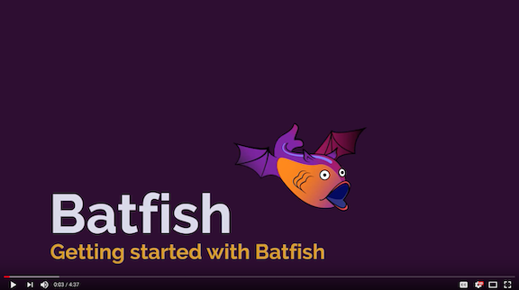

**Got questions, feedback, or feature requests? Join our community on [Slack!](https://join.slack.com/t/batfish-org/shared_invite/enQtMzA0Nzg2OTAzNzQ1LTcyYzY3M2Q0NWUyYTRhYjdlM2IzYzRhZGU1NWFlNGU2MzlhNDY3OTJmMDIyMjQzYmRlNjhkMTRjNWIwNTUwNTQ)**

[](https://codecov.io/gh/batfish/pybatfish)

# Pybatfish

Pybatfish is a Python client for [Batfish](https://github.com/batfish/batfish). 


## What is Batfish?

Batfish is a network validation tool that provides correctness guarantees for security, reliability, and compliance by analyzing the configuration of network devices. It builds complete models of network behavior from device configurations and finds violations of network policies (built-in, user-defined, and best-practices).

A primary use case for Batfish is to validate configuration changes *before* deployment (though it can be used to validate deployed configurations as well). Pre-deployment validation is a critical gap in existing network automation workflows. By  Batfish in automation workflows, network engineers can close this gap and ensure that only correct changes are deployed.

**Batfish does NOT require direct access to network devices.** The core analysis requires only the configuration of network devices. This analysis may be enhanced using additional information from the network such as:
* BGP routes received from external peers
* Topology information represented by LLDP/CDP

See [www.batfish.org](http://www.batfish.org) for technical information on how it works. 

## What kinds of correctness checks does Batfish support?

[](https://www.youtube.com/channel/UCA-OUW_3IOt9U_s60KvmJYA/videos)

The [Batfish YouTube channel](https://www.youtube.com/channel/UCA-OUW_3IOt9U_s60KvmJYA/videos) (which you can subscribe to for new content) illustrates many types of checks. These checks span a range of network behaviors and device configuration attributes.
#### Configuration Compliance
* Flag undefined-but-referenced or defined-but-unreferenced structures (e.g., ACLs, route maps)
* Configuration settings for MTUs, AAA, NTP, logging, etc. match templates
* Devices can only be accessed using SSHv2 and password is not null
#### Reliability
* End-to-end reachability is not impacted for any flow after any single-link or single-device failure
* Certain services (e.g., DNS) are globally reachable
#### Security
* Sensitive services can be reached only from specific subnets or devices
* Paths between endpoints are as expected (e.g., traverse a firewall, have at least 2 way ECMP, etc...)
#### Change Analysis
* End-to-end reachability is identical across the current and a planned configuration
* Planned ACL or firewall changes are provably correct and causes no collateral damage for other traffic
* Two configurations, potentially from different vendors, are functionally equivalent

## How do I get started?

If you haven't already installed Batfish, follow the instructions listed in the [batfish github repository](https://github.com/batfish/batfish/blob/master/README.md) to do so.

### Install Pybatfish
We highly recommend that you install Pybatfish in a Python 3 virtual environment. Details on how to set one up can be found [here](https://docs.python.org/3/library/venv.html). Once your virtual environment is setup and activated, upgrade pip and then install pybatfish.

```
python3 -m pip install --upgrade pip
python3 -m pip install --upgrade pybatfish
```

Now, you are ready to evaluate your own network with Batfish. We encourage you to use Jupyter notebooks as your starting point, but you can use other methods that you are a comfortable with, e.g., an IDE like PyCharm or an interactive Python shell. If you choose to use Jupyter notebooks as your starting point, you need to install Jupyter in your virtual environment. Jupyter documentation can be found [here](http://jupyter.org/install) - but the commands below will get you going.

```
python3 -m pip install jupyter
jupyter notebook
```

Our notebooks provide a quick start guide for different use cases. Beyond that, the complete documentation is available on [readthedocs](https://pybatfish.readthedocs.io/en/latest/quickstart.html).

### Pybatfish documentation

Complete documentation of pybatfish APIs is [here](https://pybatfish.readthedocs.io/en/latest/).
